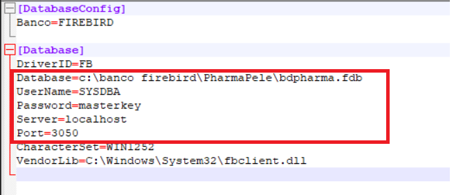

# Sistema de delivery para farmácias

## Desafio técnico - Pharmapele

## Menu

- [Introdução](#introdução)
  
- [Configurações Iniciais](#configurações)

- [Arquitetura](#arquitetura)

- [Dicas de Uso](#dicas)

- [Padrões Aplicados](#padrões)

- [Boas Práticas](#boas)

## Introdução

Este projeto é uma aplicação Delphi, desenvolvida como forma de desafio técnico para o processo seletivo para uma vaga de programador Delphi. A aplicação registra os pedidos, possibilitando a inclusão, alteração e exclusão de pedidos e seus respectivos itens, além da pesquisa pelo código da venda ou através de uma interface de pequisa, permitindo a navegação entre registros, exibindo ou atualizando os dados armazenados no banco de dados.

image.png

## Configurações

Para que seja possível a execução da aplicação, é necessário que seja criado um banco de dados Firebid, cujo script para criação do banco de dados (*Script Criação de Tabelas*), criação das tabelas utilizadas na aplicação e população de registros nas tabelas, encontra-se disponível dentro do projeto na pasta *Docs*. 

Na pasta do projeto, encontra-se o arquivo *pharma.ini* contendo as informações necessárias para que a aplicação conecte com o banco de dados criado anteriormente. Também encontra-se na pasta do projeto o arquivo *Instrução para configuração do banco de dados a ser utilizado.pdf*, contendo todas as instruções para execução do script de criação das tabelas e configuração do arquivo *pharma.ini".

[Abrir PDF](Instrução para configuração do banco de dados a ser utilizado.pdf)

Com qualquer editor de arquivos TXT (ex: bloco de notas), é possível fazer as alterações no arquivo *pharma.ini" para que seja possível realizar a conexão ao banco de dados e consequentemente, executar a apliacação sem erros.

## Arquitetura

A arquitetura do projeto segue o padrão MVC (Model-View-Controller), que promove uma separação clara de responsabilidades, facilitando a manutenção, escalabilidade e compreensão do código:

**Model**: Responsável por representar os dados e a lógica de negócios da aplicação. Exemplos incluem as classes cliente.model, pedido.model e produto.model.

**View**: Composta pelos formulários Delphi que interagem com o usuário. Esses formulários lidam exclusivamente com a apresentação dos dados (exemplo: FrmMain e FrmCadVenda).

**Controller**: Realiza a comunicação entre o Model e a View, gerenciando as regras de negócio e a lógica de interação do usuário (exemplo: pedido.controller).

Essa abordagem garante a separação das camadas e melhora a legibilidade do código.

## Design Patterns
O projeto implementa diversos padrões de design que reforçam a flexibilidade e a organização do código:

**Singleton**: Utilizado para a classe TConnection, garantindo uma única instância de conexão com o banco de dados, reduzindo a sobrecarga de recursos.

**Repository**: Responsável pelas operações de persistência no banco de dados, como demonstrado na classe pedido.repository.
Service: Centraliza a lógica de negócios mais complexa, como na classe pedido.service, que encapsula operações que não estão diretamente ligadas à camada de apresentação.

## Princípios SOLID
Os princípios SOLID foram aplicados para promover um design robusto e de fácil manutenção:

**Single Responsibility Principle (SRP)**: Cada classe tem uma responsabilidade única e bem definida. Por exemplo, a cliente.repository lida apenas com operações no banco relacionadas ao cliente.
Open/Closed Principle (OCP): O sistema foi projetado para ser aberto para extensões (novas funcionalidades), mas fechado para alterações nas partes existentes.

**Liskov Substitution Principle (LSP)**: Interfaces como IRepository garantem que diferentes implementações possam ser substituídas sem alterar o comportamento esperado.

**Interface Segregation Principle (ISP)**: Interfaces pequenas e específicas foram criadas para evitar dependências desnecessárias, como IPedidoService e IPedidoRepository.

**Dependency Inversion Principle (DIP)**: A aplicação desacopla dependências diretas entre camadas utilizando injeção de dependência e abstrações, como o uso de interfaces.

## Boas Práticas

- **Clean Code**: O código foi escrito seguindo princípios de clean code, com nomes de variáveis e métodos claros, funções curtas e bem definidas.

- **Tratamento de Erros**: Implementação de mensagens amigáveis ao usuário para tratamento de erros e validação de dados.

- **Uso de Tabelas Temporárias**: Utilização de tabelas temporárias para armazenar dados intermediários durante as operações de consulta.

## Dicas de Uso

A interface principal da aplicação é apresentada contendo os botões de opções (Clientes, Produtos, Entregadores, Pedidos, Criar Entregas, Ver Entregas e Sair), Através dessa interface que serão abertas as telas de uso da aplicação. 

### Cadastro de Clientes

Na interface principal, ao clicar no botão **"Cliente"**, será exibida a interface de produtos, contendo os dados do cliente, uma grade contendo todos os clientes cadastrados, uma área para pesquisa no grid (podendo ser alterada a forma de pesquisa por nome do cliente ou cidade), além dos botões de ação (Incluir, Alterar, Excluir, Gravar, Cancelar e Sair), localizados acima da tela.

Para selecionar um registro da grade, basta dar um duplo click no registro escolhido, que todas as informações do cliente serão mostradas na área destinada aos dados do cliente. Pode-se também, navegar pela grade usando as setas e ao acionar a tecla *Enter* o registro será exibido na área de dados do produto, ja em estado de edição.

- Botão Inserir: Ao clicar no botão "**Inserir**", será liberada a área de dados do cliente para a digitação das informações para a inclusão de um novo cliente. Nesse momento, os botoes "**Gravar**" e "**Cancelar**" ficam habilitados e os demais botões ficam desabilitados, ficando para o usuário as opções de gravar o produto ou cancelar a inclusão.

- Botão Alterar: Após selecionar um registo na grade, fica habilitado o botão "**Alterar**". Ao clicar no botão "**Alterar**", será liberada a área de dados do cliente para a alteração das informações referentes ao cliemte. Nesse momento, os botoes "**Gravar**" e "**Cancelar**" ficam habilitados e os demais botões ficam desabilitados, ficando para o usuário as opções de gravar o produto ou cancelar a alteração.

- Botão Excluir: Após selecionar um registo na grade, fica habilitado o botão "**Excluir**". Ao clicar no botão "**Excluir**", será feita uma pergunta ao usuario se ele deseja excluir o registro selecionado. Caso o usuário responda "Sim", o registro será excluído definitivamente do cadastro de clientes.

- Botão Sair: Fecha a tela do cadastro de produtos e retorna ao menu inicial.

### Cadastro de Produtos e Entregadoes

Segue o mesmo padrão de uso do cadastro de clientes, podendo realizar as mesmas operações 

### Cadastro de Pedidos

Na interface principal, ao clicar no botão **"Pedidos"**, será exibida a interface de pedidos contendo os dados do pedido e uma grade para os produtos cadastrados, além dos botões de ação (Incluir, Alterar, Excluir, Gravar, Cancelar e Sair), localizados acima da tela.

Para acessar um pedido cadastrado o usuário pode informar o codigo da venda no campo apropriado e em seguida clicar no botão "**Pesquisar**" 

Caso o usuário deseje fazer uma pesquisa de todas as vendas cadastradas, basta clicar no botão pesquisar e será exibida uma tela contendo todas os pedidos cadastrados para que o usuário escolha o pedido desejado.

Para selecionar um registro, o usuário pode clicar no botão "**Selecionar**", pode dar um duplo click no registro desejado ou navegar pelo grid usando as setas e acionar a tecla *Enter* para selecionar um registro, nesse caso, o resgistro será exibido, já estando em modo de edição. A pesquisa pode ser refinada, escolhendo o filtro para a pesquisa e informando um valor para pesquisa, valor esse que pode ser parte da informação ou a informação completa.

Os botões de ação seguem o mesmo comportamento dos botões de ação da tela de produtos/clientes/entregadores, explanados anteriormente.

Para a inclusão de pedidos, seguir os passos abaixo:

Clicar no botão **Novo** para liberar a digitação dos dados do pedido.

Após preencher os dados do pedido, **Adiconar Itens** para liberar a inclusão dos itens do produto.

Escolha o produto, informe a quantidade, o preço unitário (caso exista valor informado no cadastro para o produto escolhido, o campo "*Preço Unitário**" será preenchido automaticamente, podendo o mesmo ser alterado de acordo com o desejo do usuário) e o preço total do item.

Clique no botão **Adicionar Pproduto** no pedido e o mesmo ir para a grade de produtos cadastrados.

Caso deseje excluir um produto cadastrado, clique no **Deletar Item** para exluir o produto da grade de produtos cadastrados.

Após incluir os itens desejados, clicar no botão **Gravar** para realizar a inclusão do pedido.

